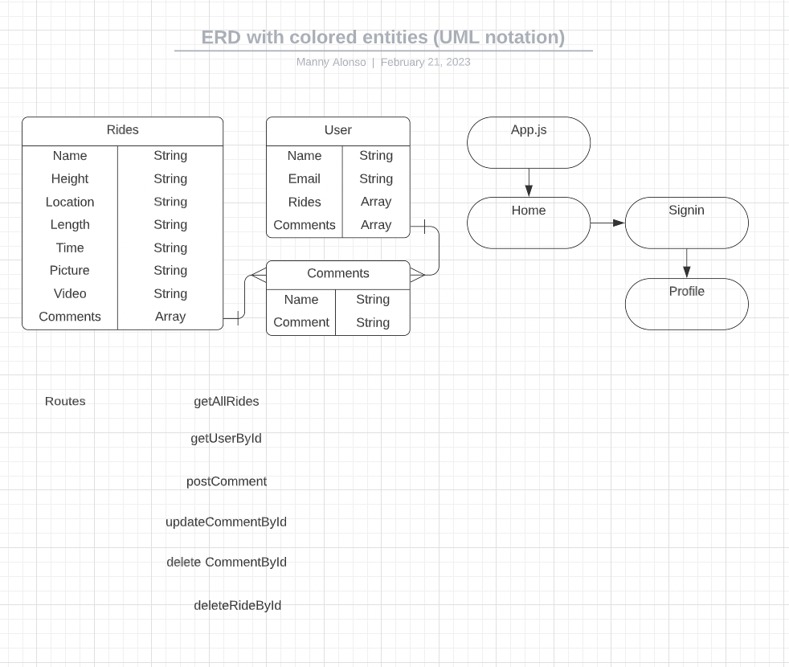

# Coaster!

## **Date 2/21/2023**

### **By: Chikodi Merenu, John Lindner, Manuel Alonso**

#### [Chikodi's LinkedIn](www.linkedin.com/in/chikodimerenu) | [Jon's LinkedIn](https://www.linkedin.com/in/jon-lindner-807847183/) | [Manuel's LinkedIn]() | [Github](https://github.com/jonclindner/Coaster) | [Trello](https://trello.com/b/2kT4s1jY/coaster)

---

## **_Description_**

### 

####

---

### **_*Technologies Used*_**

- Mongoose
- Express
- React
- Node

---

### **_Getting Started_**

### 

### **Objective**

### To track some of the most popular roller coaster rides around the world and there reviews.

### **Flow**

###

##

#### A Trello band was used to keep track of development progress and can be viewed [Trello](https://trello.com/b/2kT4s1jY/coaster)

#### The project itself was deployed and can be viewed [Github](https://github.com/jonclindner/Coaster).

---

### **_Screenshots_**

#### **Wardrobe Screen**

#### 

#### **Add Clothes Screens**

#### 

#### **About Screens**

#### 

---

## **Future Updates:**

-

---

## **Credits**

### **Images:** 

### **Images:** [Google]()
